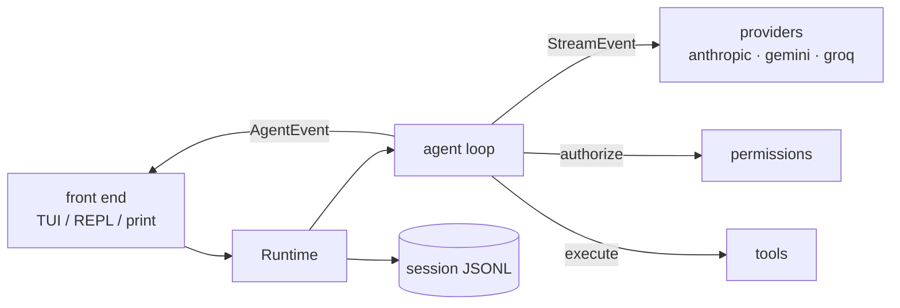

# kite

A coding agent for your terminal, written in TypeScript. It reads, searches and edits your code and runs commands, on the model of your choice, and it asks before it changes anything.

<!-- demo GIF goes here: docs/demo.gif -->

- **Several providers, one interface.** Anthropic, Gemini and Groq, with streaming end to end.
- **Permission-gated tools.** Reads run freely. Edits, writes, shell commands and commits ask first, with a diff for edits.
- **Resumable sessions.** Every conversation is saved as an append-only JSONL file you can pick up later.
- **Context compaction.** Long sessions are summarized automatically before they hit the model's limit.
- **Three ways to run it.** An interactive UI, a plain-text chat, or a one-shot `-p` command for scripts.
- **Small and readable.** About 2,800 lines of TypeScript with 73 tests. The design is written up in [docs/design.md](docs/design.md).

> Status: early (v0.1). It works, it is tested, and it will change. See the [roadmap](#roadmap).

## Install

Requires Node.js 22 or newer.

```sh
npm install -g kite-agent
kite --help
```

Or from a checkout:

```sh
git clone https://github.com/ChandanKhamitkar/Kite.git
cd Kite
npm install
npm run dev -- --help      # run from source
npm run build && node bin/kite.js --help
```

## Quick start

Set an API key for the provider you want (a shell variable, `./.env`, or `~/.kite/.env`):

| Provider | Variable | Default model |
| --- | --- | --- |
| `anthropic` (default) | `ANTHROPIC_API_KEY` | `claude-sonnet-5-5` |
| `gemini` | `GEMINI_API_KEY` | `gemini-2.5-flash` |
| `groq` | `GROQ_API_KEY` | `openai/gpt-oss-120b` |

Then run it in the project you want help with:

```sh
cd my-project
kite                                   # interactive UI
kite --provider groq                   # pick a provider
kite --provider gemini --model gemini-2.5-pro
kite -p "find where config is loaded and explain it"   # one prompt, then exit
kite -c                                # continue the last session in this folder
```

Model names change often. If a provider answers "not found", pass `--model` with a current one.

## Modes

| Command | What you get |
| --- | --- |
| `kite` | Full interactive UI (needs a terminal): streamed answers, tool cards, diff previews, status bar. |
| `kite --repl` | The same chat as plain text on readline. |
| `kite -p "..."` | One prompt, plain output, exits. Good for scripts. Pair with `--yes` only if you trust the task. |

In the UI: **Enter** sends, **Esc** or **Ctrl+C** interrupts a running turn (and kills a running command), **Ctrl+C twice** on an empty prompt quits, arrow keys browse history.

### Slash commands

| Command | Does |
| --- | --- |
| `/help` | list commands |
| `/model [name]` | show or change the model |
| `/provider [name] [model]` | show or change the provider |
| `/compact` | summarize older messages now |
| `/clear` | start a new conversation |
| `/sessions` | list recent sessions |
| `/cost` | token usage and context fill |
| `/exit` | quit |

## Tools

| Tool | Risk | What it does |
| --- | --- | --- |
| `read` | read | Read a file, optionally a line range |
| `ls`, `find`, `grep` | read | List, glob and regex-search (skip `node_modules`, `.git`, binaries) |
| `git_status`, `git_diff`, `git_log` | read | Inspect the repository |
| `write` | write | Create or overwrite a file |
| `edit` | write | Replace an exact string (must match once, or set `replace_all`) |
| `bash` | exec | Run a shell command with a timeout and output cap |
| `git_commit` | exec | Stage and commit |

File tools cannot leave the working directory: `..`, absolute paths and symlinks that point outside are rejected. Large outputs are truncated and the model is told so.

## Permissions

`read`-risk tools run without asking. Everything else prompts:

```
? bash wants to run (exec):
  $ npm test
  Allow? [y]es / [n]o / [a]lways this session:
```

"Always" applies to that tool until you quit. A denied call goes back to the model as an error, so it can try something else. Without a terminal and without `--yes`, risky tools are denied.

You can also write rules. `tool` or `tool:pattern`, where `*` matches anything:

```json
{
  "permissions": {
    "allow": ["bash:npm test*", "edit:src/*"],
    "deny": ["bash:rm *", "git_commit"]
  }
}
```

Deny rules always win, even over `--yes`.

> **Heads up:** a pattern like `bash:npm test*` also matches `npm test && rm -rf x`. Use allow rules only for commands you trust. Real sandboxing is on the roadmap.

## Configuration

Later sources override earlier ones:

1. built-in defaults
2. `~/.kite/config.json` (global)
3. `.kite.json` in the current folder (project)
4. `KITE_PROVIDER`, `KITE_MODEL`, `KITE_MAX_TURNS`, `KITE_CONTEXT_WINDOW`
5. command-line flags

```json
{
  "provider": "anthropic",
  "model": "claude-sonnet-5-5",
  "maxTurns": 20,
  "contextWindow": 200000,
  "compactAt": 0.8,
  "keepRecent": 6,
  "systemPrompt": "Prefer small, focused changes.",
  "permissions": { "allow": [], "deny": [] }
}
```

Permission rules from every layer are combined. Set `KITE_HOME` to move `~/.kite` somewhere else.

**Project instructions:** put a `KITE.md` (or `AGENTS.md`) in your repo and its contents are added to the system prompt.

## Sessions

Each run is saved to `~/.kite/sessions/<id>.jsonl`, one line per message, written as it happens, so a crash loses nothing. Resume with `kite -c` (latest in this folder) or `kite -r <id>`. `kite --sessions` lists them.

When the context passes `compactAt` of the model's window, older messages are summarized by the same model and replaced by one summary; the last `keepRecent` messages stay as they were. Tool calls and their results are never split.

## Architecture



Two event streams keep the pieces apart: providers emit `StreamEvent`s into the loop, and the loop emits `AgentEvent`s to whichever front end is running. Adding a provider does not touch the loop, and adding a front end does not touch the providers. [docs/design.md](docs/design.md) covers the reasoning.

```
src/
  agent/        the loop and context compaction
  providers/    anthropic, openai-compatible (gemini, groq), error handling
  tools/        read, write, edit, ls, find, grep, bash, git
  permissions/  risk-based authorizer, rules, terminal prompt
  config/       config cascade and system prompt
  session/      JSONL persistence and replay
  tui/          Ink UI (state reducer, input editing, components)
  modes/        print and REPL
  runtime.ts    ties config, provider, session and loop together
  commands.ts   slash commands
```

## Development

```sh
npm install
npm run dev -- -p "hello"   # run from source
npm test                    # 73 tests, no API keys needed
npm run lint                # Biome
npm run typecheck
npm run build               # emits dist/
```

The tests use a scripted fake provider, so they run offline. Tools are tested against temporary folders and a throwaway git repo.

## Roadmap

Not built yet, in rough order:

- Sandboxed runs: work in a git worktree, review the diff, then apply or discard, with undo for every edit.
- Cost tracking per session with a budget cap.
- A benchmark command that runs the same tasks across providers and compares pass rate, cost and speed.
- A local web view for replaying sessions.

## Known limitations

- Output tokens are capped at 4096 per Anthropic turn (not yet configurable).
- Cost is shown as tokens only; there is no pricing table yet.
- Tool results are previewed in the UI, not expandable.
- Gemini and Groq go through their OpenAI-compatible endpoints, and tool calling quirks differ by model.
- Wildcard permission rules are convenience, not a security boundary.

## License

MIT
